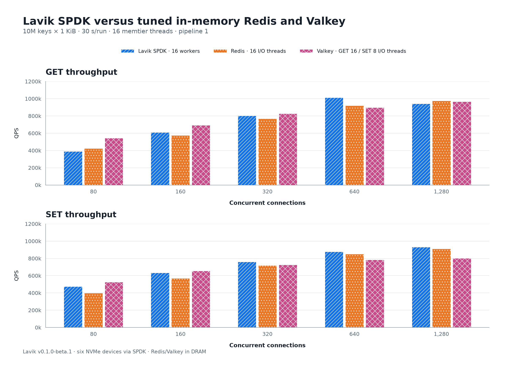
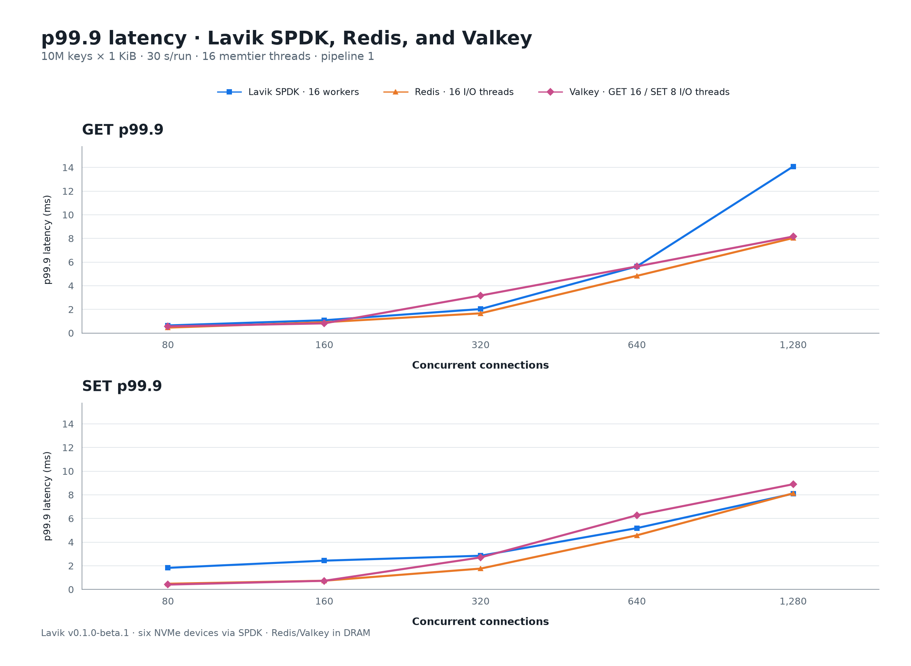
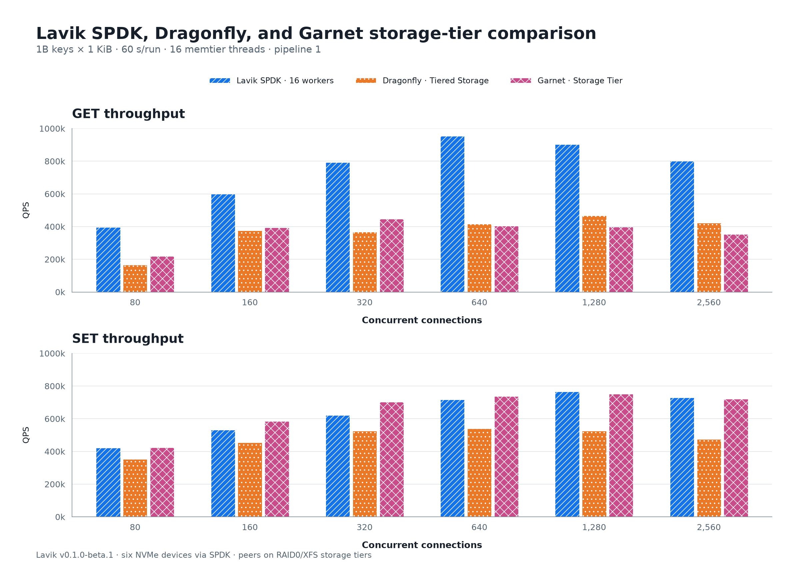
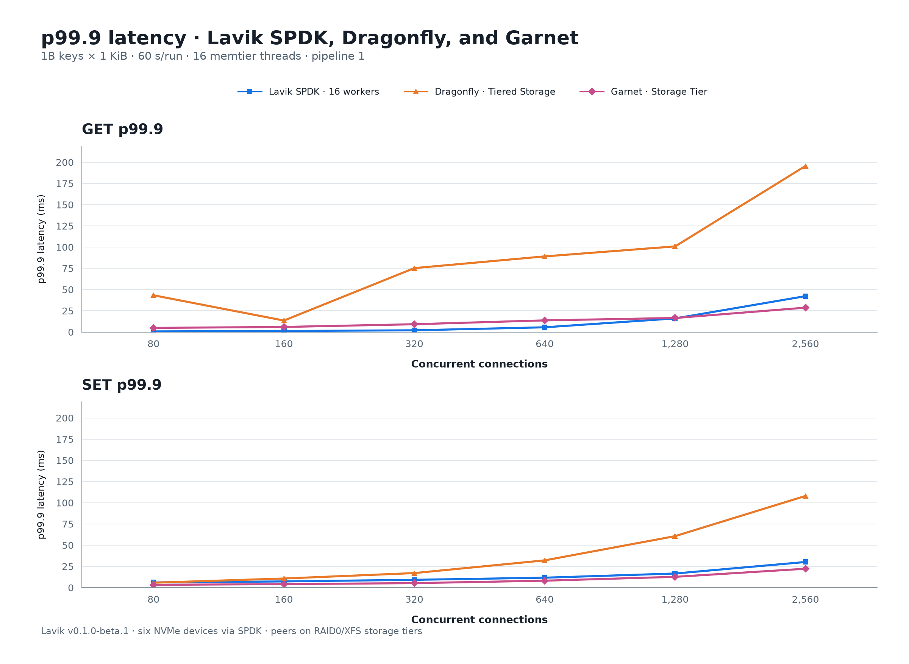
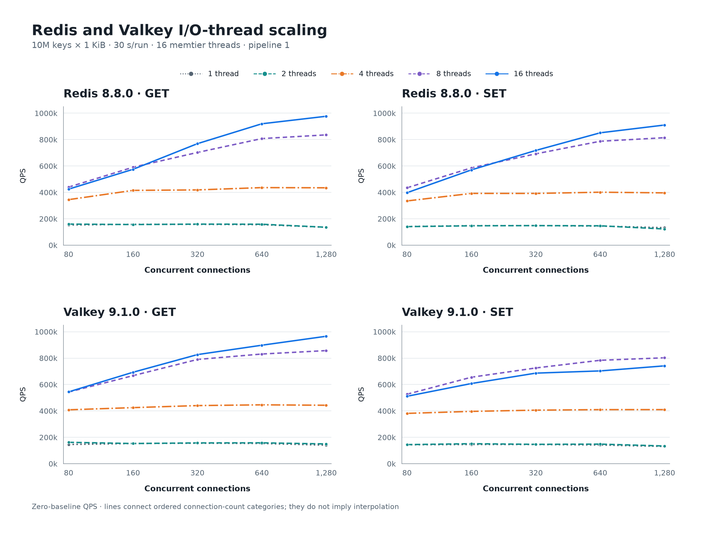

<!--
Copyright (C) 2026 EloqData Inc.

Licensed under the Apache License, Version 2.0 (the "License");
you may not use this file except in compliance with the License.
You may obtain a copy of the License at

    https://www.apache.org/licenses/LICENSE-2.0

Unless required by applicable law or agreed to in writing, software
distributed under the License is distributed on an "AS IS" BASIS,
WITHOUT WARRANTIES OR CONDITIONS OF ANY KIND, either express or implied.
See the License for the specific language governing permissions and
limitations under the License.
-->

# Lavik v0.1.0-beta.1：SPDK 与竞品对比

[English](README.md) | **简体中文**

使用实际下载的标准 beta 发布包，在独立清盘重灌的数据集上测量 SPDK；报告包含新测的 22 个 Lavik 点，以及当天早些时候在相同主机上完成的 124 个竞品对照点。本报告不纳入 io_uring。

- 1000 万条 GET：SPDK 峰值 **1012.2k QPS**（640 连接），该点 p99 **3.599 ms**、p99.9 **5.631 ms**。
- 1000 万条 SET：SPDK 峰值 **930.5k QPS**（1280 连接），该点 p99 **4.799 ms**、p99.9 **8.095 ms**。
- 10 亿条 GET：SPDK 峰值 **952.6k QPS**（640 连接），该点 p99 **3.599 ms**、p99.9 **5.535 ms**。
- 10 亿条 SET：SPDK 峰值 **764.9k QPS**（1280 连接），该点 p99 **10.879 ms**、p99.9 **16.639 ms**。

## 1000 万条：Redis / Valkey 内存组



| Command | System | Threads¹ | Connections | QPS | Avg ms | p50 ms | p99 ms | p99.9 ms | p99.99 ms |
| --- | --- | --- | --- | --- | --- | --- | --- | --- | --- |
| GET | Lavik SPDK | 16 | 640 | 1,012,180 | 0.632 | 0.543 | 3.599 | 5.631 | 10.239 |
| GET | Redis 8.8.0 | 16 | 1280 | 976,801 | 1.310 | 1.119 | 4.671 | 8.031 | 17.407 |
| GET | Valkey 9.1.0 | 16 | 1280 | 965,697 | 1.325 | 1.111 | 4.543 | 8.159 | 16.895 |
| SET | Lavik SPDK | 16 | 1280 | 930,465 | 1.375 | 1.143 | 4.799 | 8.095 | 17.535 |
| SET | Redis 8.8.0 | 16 | 1280 | 910,426 | 1.405 | 1.167 | 4.831 | 8.127 | 16.895 |
| SET | Valkey 9.1.0 | 8 | 1280 | 802,519 | 1.594 | 1.423 | 4.383 | 8.895 | 16.895 |



Redis、Valkey 按每个命令的实测峰值固定选择一个 I/O 线程配置：Redis GET/SET 均为 16，Valkey GET 为 16、SET 为 8。柱状图展示该配置在全部连接数下的结果，延迟图使用相同选择。

## 10 亿条：Dragonfly / Garnet 存储层组



| Command | System | Threads¹ | Connections | QPS | Avg ms | p50 ms | p99 ms | p99.9 ms | p99.99 ms |
| --- | --- | --- | --- | --- | --- | --- | --- | --- | --- |
| GET | Lavik SPDK | 16 | 640 | 952,560 | 0.671 | 0.543 | 3.599 | 5.535 | 9.791 |
| GET | Dragonfly 1.40.2 | 16 | 1280 | 466,039 | 2.746 | 1.455 | 38.911 | 100.863 | 217.087 |
| GET | Garnet 2.1.5 | 16 | 320 | 446,366 | 0.716 | 0.423 | 4.223 | 9.151 | 20.607 |
| SET | Lavik SPDK | 16 | 1280 | 764,939 | 1.672 | 1.087 | 10.879 | 16.639 | 22.143 |
| SET | Dragonfly 1.40.2 | 16 | 640 | 539,616 | 1.185 | 0.783 | 14.591 | 32.127 | 48.639 |
| SET | Garnet 2.1.5 | 16 | 1280 | 751,057 | 1.703 | 1.383 | 5.535 | 12.735 | 20.863 |



## Redis / Valkey I/O 线程扫描



四个面板分别展示 Redis/Valkey 的 GET/SET；每个面板保留 1/2/4/8/16 个 I/O 线程的完整连接数曲线。下表汇总各条曲线的最大值。

| 产品 | I/O 线程 | GET 峰值 QPS @ 连接数 | SET 峰值 QPS @ 连接数 |
| --- | --- | --- | --- |
| Redis 8.8.0 | 1 | 157,964 @ 160 | 148,280 @ 320 |
| Redis 8.8.0 | 2 | 159,791 @ 80 | 148,384 @ 320 |
| Redis 8.8.0 | 4 | 436,230 @ 640 | 401,369 @ 640 |
| Redis 8.8.0 | 8 | 835,794 @ 1280 | 814,410 @ 1280 |
| Redis 8.8.0 | 16 | 976,801 @ 1280 | 910,426 @ 1280 |
| Valkey 9.1.0 | 1 | 155,408 @ 320 | 145,804 @ 160 |
| Valkey 9.1.0 | 2 | 162,097 @ 80 | 151,504 @ 160 |
| Valkey 9.1.0 | 4 | 446,155 @ 640 | 409,846 @ 1280 |
| Valkey 9.1.0 | 8 | 857,049 @ 1280 | 802,519 @ 1280 |
| Valkey 9.1.0 | 16 | 965,697 @ 1280 | 741,469 @ 1280 |

## SPDK 配置与复现

先按 [SPDK 存储操作指南](../../docs/operations/spdk-storage.md) 配置。
指南覆盖标准发布包选择、获取匹配版本的设备绑定脚本（无需编译 Lavik）、
序列号与 PCI 地址识别、VFIO/hugepages、启动、配置检查和停止后的驱动恢复。
必须使用包含 SPDK 的标准包，不能用 minimal 包；本次网络仍为 kernel TCP。

本次使用的 6 块专用 NVMe：

| Serial | PCI address | Namespace | Capacity (bytes) |
|---|---|---|---:|
| 40291d45b421bc880001 | `f698:00:00.0` | 1 | 1919850381312 |
| 40291d45b421bc880002 | `d2b4:00:00.0` | 1 | 1919850381312 |
| 40291d45b421bc880003 | `9038:00:00.0` | 1 | 1919850381312 |
| 40291d45b421bc880004 | `3da6:00:00.0` | 1 | 1919850381312 |
| 40291d45b421bc880005 | `674c:00:00.0` | 1 | 1919850381312 |
| 40291d45b421bc880006 | `d408:00:00.0` | 1 | 1919850381312 |

上表地址只属于本次主机，复现时替换为自己核对过的专用控制器；绑定会影响
该控制器的全部 namespace。下面的 `LAVIK_SPDK_SETUP`、`LAVIK_BINARY` 按指南
设为绑定脚本和解压后二进制的路径。启动示例省略 `v0.1.0-beta.1` 的固定
默认参数，并替换二进制/日志目录。线程数默认跟随 `taskset` 选定的 16 个 CPU。
实际采集的完整命令保存在 `server-command.json` 中。

本次先保存 hugepages/VFIO 原值，在内核驱动下按序列号核对专用盘并逐盘
`blkdiscard`，再绑定 VFIO。因为测试 VM 没有暴露 IOMMU，本次在绑定前临时
开启 VFIO no-IOMMU；普通 IOMMU 主机不需要这一步，限制和恢复方法见指南。
清盘是全新压测数据集的准备步骤，不是已有数据库的启动或恢复步骤。

```bash
sudo env PCI_ALLOWED='f698:00:00.0 d2b4:00:00.0 9038:00:00.0 3da6:00:00.0 674c:00:00.0 d408:00:00.0' \
  DRIVER_OVERRIDE=vfio-pci HUGEMEM=8192 \
  "$LAVIK_SPDK_SETUP" config
```

1000 万条数据集使用以下启动配置：

```bash
sudo prlimit --memlock=unlimited:unlimited --nofile=65535:65535 \
  env BYCORF_DPDK_MEMORY_MB=8192 \
  BYCORF_EAL_ARGS='-a f698:00:00.0 -a d2b4:00:00.0 -a 9038:00:00.0 -a 3da6:00:00.0 -a 674c:00:00.0 -a d408:00:00.0' \
  taskset -c 0-15 "$LAVIK_BINARY" \
  --storage=spdk \
  --bind=172.16.0.4 \
  --tomb-raider-interval-ms=0 \
  --spdk-max-completions-per-poll=16 \
  --log-dir=/var/log/lavik/benchmark \
  --data-file=spdk://f698:00:00.0/1 \
  --data-file=spdk://d2b4:00:00.0/1 \
  --data-file=spdk://9038:00:00.0/1 \
  --data-file=spdk://3da6:00:00.0/1 \
  --data-file=spdk://674c:00:00.0/1 \
  --data-file=spdk://d408:00:00.0/1
```

10 亿条使用相同配置，并增加 `--shutdown-checkpoint`。两个数据集都清盘后
重新灌入，不复用其他后端的 checkpoint。EAL 预留 8 GiB，不是 Lavik 总内存上限。
`--spdk-max-completions-per-poll=16` 将默认值 `8` 改为 `16`；
`--tomb-raider-interval-ms=0` 关闭默认每天一次的 tombstone 扫描。
`CONFIG GET spdk-max-completions-per-poll` 为 `16`，foreground pre-poll
沿用默认的 5 µs。

原始证据中 `memory/lavik-spdk/`、`storage/lavik-spdk/` 分别保存完整启动命令、
EAL 环境变量、盘序列号/PCI 地址、配置检查、绑定/恢复日志和宿主设置前后值。
每个客户端点的 `*.command.json`、memtier JSON 和文本输出也都保留；复现连接数
扫描时替换为自己的服务端地址。采集脚本使用固定序列号白名单，不自动选择任意 NVMe 盘。

## 测试方法

- 实测标准 `v0.1.0-beta.1` 发布包，源提交 `3955b98d43b312324aa8d52775df52cfb111c0d0`，二进制 SHA-256 `b14da83ef4f3146848e8b27f4c556d01696e8f28398cf38f3a97bd68d68b1a31`；版本输出为 `lavik 0.1.0-beta.1`。发布的归档校验值已通过核对，没有自行编译或修改源码。
- 服务端为 EPYC 9V74（8 核 / 16 线程，约 126 GiB RAM），客户端为 EPYC 9V45（16 核，约 31 GiB RAM），均限制在 CPU 0–15。产品串行运行，期间不调整 CPU/IRQ 策略。
- Lavik 为 16 worker、kernel TCP、6 块 NVMe SPDK、busy-poll 20 µs、foreground/background budget 1000/10 µs、background warrant 1%、Tomb Raider 关闭。8 GiB hugepages，completion cap=16，foreground pre-poll=5 µs。每组结束恢复驱动、hugepages 和 VFIO 原值。
- Redis 8.8.0、Valkey 9.1.0 扫描 1/2/4/8/16 I/O 线程，关闭 AOF 和自动快照；每个配置从该产品新灌并验证的基线 RDB 重启。Dragonfly 1.40.2 使用 16 proactor、96 GiB maxmemory 和 Tiered Storage；Garnet 2.1.5 使用 64 GiB hybrid log、32 GiB read cache、16 GiB index 和 Libaio Storage Tier。存储对照使用相同 6 块盘组成的 RAID0/XFS 文件。
- memtier 2.5.1，16 线程，pipeline=1，无限速；十进制键 1..N、无前缀、1024 B value，均匀随机 GET 或覆盖 SET。10M 每点 30 秒、80/160/320/640/1280 连接；1B 每点 60 秒，另加 2560 连接。Lavik 10M、Redis、Valkey 预热 GET 10 秒；Dragonfly、Garnet 额外预热 GET 180 秒（8 线程、80 连接）；Lavik 1B 不额外预热。
- 10M 保留历史脚本的默认相关随机流；1B 全部产品使用 `--distinct-client-seed`，避免多个客户端重复同一随机序列制造缓存局部性。与 9 月 6 日原报告相比，客户端随机流和 Clang/native → GCC/x86-64-v2 构建有差异，不能把差异单独归因于代码。
- 全部配置测前检查精确键数和采样值长度；除 Garnet 外，测后也完成同样检查。Garnet 测前暂停后续压缩，等待日志边界稳定并完成扫描后恢复 Lookup；每个正式点确认 Lookup。其 12 个正式点结束后按用户要求停止耗时测后扫描，测后键数和值长度未验证。中断记录和实际 SIGTERM 退出码保留在证据里。测前扫描也会影响缓存历史。
- 146 个正式点均无连接错误，GET 无 miss。这不能替代 Garnet 缺少的测后精确计数。本轮新测 22 个 SPDK 点，复用当天早些时候的 124 个竞品点；来源、时间戳见 `control-provenance.json` 和原始证据。先前 nightly 和 io_uring 尝试单独保存，均不计入本报告。
- 各产品的每个命令、连接数和服务端线程配置均测一轮：10M 每点 30 秒，1B 每点 60 秒；峰值为连接数扫描的最大值。产品的内存预算、缓存、磁盘拓扑和持久性语义不同；不能跨 10M / 1B 两组混排，也不能声称等持久性成本。详细方法见英文版。

¹ 线程含义不同：Lavik 为 worker，Redis/Valkey 为 I/O 线程，Dragonfly 为 proactor，Garnet 为线程池最低线程数；Garnet 实际总线程数不固定为 16，全部线程共享 CPU 0–15。

[全部 146 个点](results.csv) · [10M 数据](memory-results.csv) · [1B 数据](storage-results.csv) · [发布包身份](binary.json) · [竞品来源](control-provenance.json) · [原始证据](evidence.tar.gz) · [文件校验值](raw-SHA256SUMS)

## 重新生成图表

[build_assets.py](build_assets.py) 只读取本目录已提交的 [results.csv](results.csv)，
先检查完整 146 个点，再生成 5 组 SVG/PNG。图表沿用原报告的分组柱状图、
GET/SET 上下排列、线程扫描四宫格以及蓝/橙/洋红配色；QPS 从零开始，
延迟图使用与吞吐对比一致的线程配置。原始证据中的采集脚本保留初次导出逻辑，
本报告当前图表以这里提交的脚本为准。

在仓库根目录执行：

```bash
python3 -m venv /tmp/lavik-chart-venv
/tmp/lavik-chart-venv/bin/pip install matplotlib==3.11.2
/tmp/lavik-chart-venv/bin/python perf_reports/lavik-v0.1.0-beta.1-spdk-vs-peers-2026-09-18/build_assets.py
```

此命令只读取 CSV、写入图片，不启动服务、不访问压测盘。
