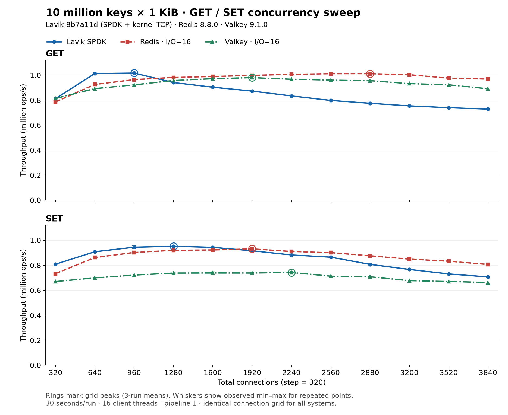

# Higher-concurrency GET / SET follow-up

| System | GET peak QPS (connections) | SET peak QPS (connections) |
|---|---:|---:|
| Lavik SPDK | 1,016,587 (960) | 951,893 (1280) |
| Redis 8.8.0 · I/O=16 | 1,011,652 (2880) | 931,332 (1920) |
| Valkey 9.1.0 · I/O=16 | 980,076 (1920) | 742,239 (2240) |

## Workload and build

- 10 million keys, 1024-byte values, uniform random GET or overwriting SET; memtier 2.5.1, 16 client threads, pipeline 1, 30 seconds per run. Default correlated client seeds match the original 10M-key test.
- Common connection counts: 320, 640, 960, 1280, 1600, 1920, 2240, 2560, 2880, 3200, 3520, 3840. Both operations use all points for all three systems (72 combinations). Only the 16-I/O-thread Redis/Valkey configurations are included.
- Server: Standard_L16aos_v4, AMD EPYC 9V74, 16 logical CPUs, approximately 126 GiB RAM; client: Standard_F16als_v7, AMD EPYC 9V45, 16 CPUs. Server and client use CPUs 0–15 on separate hosts.
- Lavik commit `8b7a11d1c8c6d9ae8ceb52c4233571cd9dfb636e`, runtime `f301f367b3177134c7a7a35698e07b22d3185627`: GCC 13 Release/LTO, x86-64-v2, generic CRC, traces disabled, Meta disabled. See [binary manifest](lavik-binary.json). This is the optimization branch in [PR #124](https://github.com/eloqdata/lavik/pull/124), not the beta release executable.
- Lavik uses SPDK on six dedicated raw NVMe namespaces, kernel TCP, 16 pinned workers, 100 ms flush, background defrag enabled, 8 GiB hugepages, SPDK completion cap 16. Other launch arguments are preserved in the evidence snapshots.
- Redis 8.8.0 and Valkey 9.1.0 use 16 I/O threads, persistence disabled, no maxmemory limit, and maxclients 60000. Their binaries match the original report's [peer hashes](../binaries.json).
- Every new server stage receives a fresh 10M-key fill followed by a 10-second GET warmup. Measurements with the same binary, configuration and workload from earlier stages of this exploration are included. No DBSIZE or SCAN is used. All measured GETs have zero misses and all measured points have zero connection errors.

## Reading the curves

Each point is the arithmetic mean of its available runs; `n` in the data records the count. All six selected peaks have three runs. Thin error bars show the observed minimum and maximum wherever a point has repeated runs. They are not confidence intervals. The selected maxima are peaks on this measured connection grid.

Redis GET reaches its highest mean at 2880 connections and declines at higher concurrency. Every system and operation has points past its peak with falling throughput. Lavik's and Redis's GET peaks differ by about 0.5%; Lavik's SET peak is about 2.2% higher than Redis's.

## Evidence and rendering

[CSV](results.csv) · [Structured data](results.json) · [Peaks and descending points](peaks.json) · [Raw evidence](evidence.tar.gz) · [Archive SHA256](evidence.tar.gz.sha256) · [SVG](throughput.svg)

The `sources` field maps every aggregate to relative paths inside the archive. It includes original memtier output, commands, timing, derived result records, and client/server snapshots for the selected runs. Earlier off-grid probes and 8-thread runs are excluded.

Run `python3 render.py` with Matplotlib installed to verify all 72 aggregates against the archived result records and regenerate PNG/SVG figures. This does not run benchmarks or require database access.
