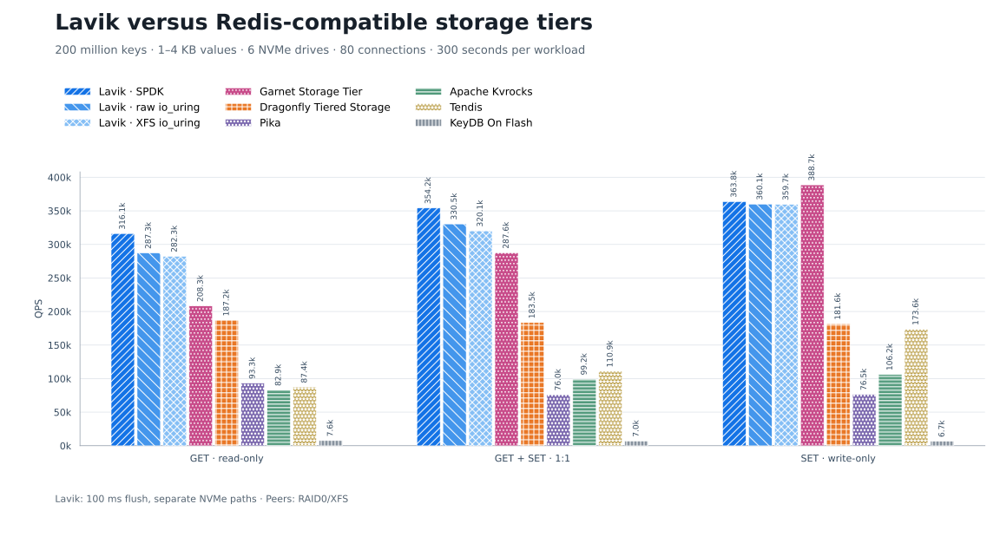
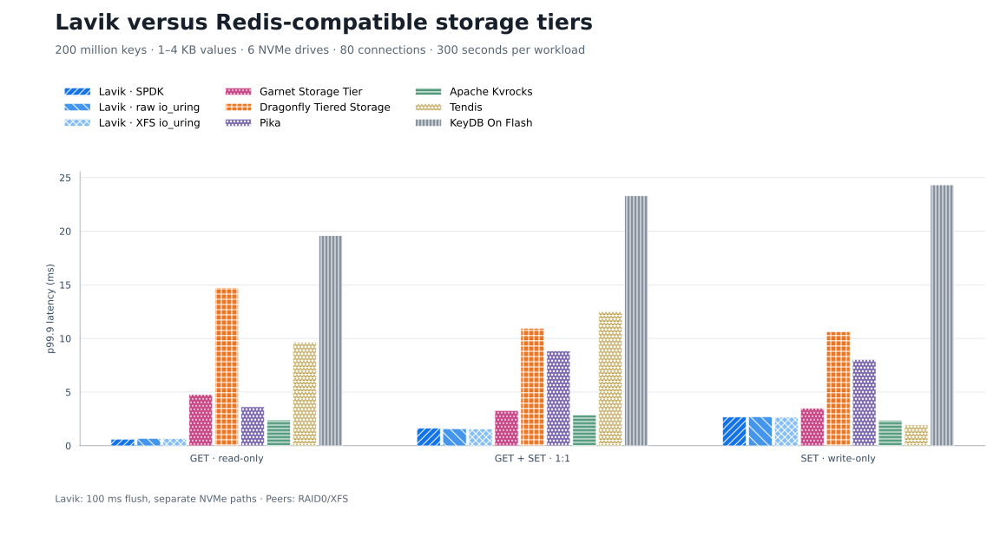

<!--
Copyright (C) 2026 EloqData Inc.

Licensed under the Apache License, Version 2.0 (the "License");
you may not use this file except in compliance with the License.
You may obtain a copy of the License at

    https://www.apache.org/licenses/LICENSE-2.0

Unless required by applicable law or agreed to in writing, software
distributed under the License is distributed on an "AS IS" BASIS,
WITHOUT WARRANTIES OR CONDITIONS OF ANY KIND, either express or implied.
See the License for the specific language governing permissions and
limitations under the License.
-->

# Lavik 与 Redis 兼容存储引擎性能对比

[English](README.md) | **简体中文**

使用下载的 [Lavik](https://github.com/eloqdata/lavik/releases/tag/v0.1.0-beta.1) 发布包，与 Dragonfly Tiered Storage、Garnet Storage Tier、Apache Kvrocks、Pika、Tendis、KeyDB On Flash 对比。数据集为 **2 亿条键、随机 1–4 KB 值**。每个产品及存储后端均重新初始化存储并完整灌入。

Lavik 使用 `--flush-max-ms=100`，将未满写入块的刷盘等待上限设为 **100 ms**。测试使用上述发布包显式传参。

## 测试结果

| 负载 | 系统 | QPS | p99 (ms) | p99.9 (ms) |
|---|---|---:|---:|---:|
| 纯读 GET | Lavik SPDK | 316,139.85 | 0.383 | 0.607 |
| 纯读 GET | Lavik raw io_uring | 287,278.40 | 0.423 | 0.679 |
| 纯读 GET | Lavik per-drive XFS io_uring | 282,293.98 | 0.431 | 0.655 |
| 纯读 GET | Garnet Storage Tier | 208,347.59 | 2.447 | 4.767 |
| 纯读 GET | Dragonfly Tiered Storage | 187,153.99 | 3.327 | 14.719 |
| 纯读 GET | Pika | 93,320.87 | 1.911 | 3.631 |
| 纯读 GET | Apache Kvrocks | 82,949.14 | 1.863 | 2.399 |
| 纯读 GET | Tendis | 87,368.36 | 1.279 | 9.663 |
| 纯读 GET | KeyDB On Flash | 7,633.56 | 13.887 | 19.583 |
| 1:1 读写 | Lavik SPDK | 354,235.51 | 0.767 | 1.639 |
| 1:1 读写 | Lavik raw io_uring | 330,474.78 | 0.751 | 1.583 |
| 1:1 读写 | Lavik per-drive XFS io_uring | 320,144.74 | 0.791 | 1.567 |
| 1:1 读写 | Garnet Storage Tier | 287,567.52 | 1.887 | 3.279 |
| 1:1 读写 | Dragonfly Tiered Storage | 183,506.95 | 4.383 | 10.943 |
| 1:1 读写 | Pika | 76,016.72 | 3.871 | 8.831 |
| 1:1 读写 | Apache Kvrocks | 99,210.78 | 1.999 | 2.879 |
| 1:1 读写 | Tendis | 110,891.11 | 1.831 | 12.543 |
| 1:1 读写 | KeyDB On Flash | 7,048.80 | 17.535 | 23.295 |
| 纯写 SET | Lavik SPDK | 363,847.67 | 1.399 | 2.671 |
| 纯写 SET | Lavik raw io_uring | 360,064.39 | 1.399 | 2.703 |
| 纯写 SET | Lavik per-drive XFS io_uring | 359,652.36 | 1.399 | 2.655 |
| 纯写 SET | Garnet Storage Tier | 388,682.07 | 1.439 | 3.487 |
| 纯写 SET | Dragonfly Tiered Storage | 181,607.64 | 5.023 | 10.623 |
| 纯写 SET | Pika | 76,481.51 | 4.015 | 8.031 |
| 纯写 SET | Apache Kvrocks | 106,180.99 | 1.679 | 2.383 |
| 纯写 SET | Tendis | 173,639.10 | 1.231 | 1.927 |
| 纯写 SET | KeyDB On Flash | 6,672.89 | 19.327 | 24.319 |

Lavik SPDK 的 GET / 混合吞吐为 **316,140 / 354,236 QPS**，均为本轮最高；Garnet 的 SET 为 **388,682 QPS**，高于 Lavik SPDK 的 **363,848 QPS**。Lavik SPDK 的 GET / 混合 / SET p99.9 为 **0.607 / 1.639 / 2.671 ms**。

## 环境与方法

| Role | Azure VM size | Address | CPU | RAM |
|---|---|---|---|---|
| Server | `Standard_L16aos_v4` | `172.16.0.4:6379` | AMD EPYC 9V74 · CPU 0–15 (8 cores / 16 threads) | about 126 GiB |
| Client | `Standard_F16als_v7` | `172.16.0.5` | AMD EPYC 9V45 · CPU 0–15 | about 31 GiB |

使用相同的 6 块专用 NVMe，每块 1,919,850,381,312 字节。Lavik SPDK 直接使用 6 个独立 namespace；裸设备 io_uring 使用 6 块独立块设备；文件 io_uring 为每块盘分别新建 XFS 文件系统，并各预分配一个 1,600 GiB 文件。其他产品使用同一组盘组成 RAID0，再新建 XFS、以 `noatime` 挂载。每换一个产品都会重新创建 RAID 和文件系统；系统盘及工作目录所在盘不参与压测。

memtier 2.5.1 以 16 个线程、640 个连接分段顺序灌入 `kv_1` 至 `kv_200000000`，值为随机 1,000–4,000 字节，客户端使用独立随机流。正式负载依次为 GET、1:1 GET/SET、SET，每项 300 秒、8 个线程、80 个连接、pipeline=1、均匀随机键、不限速。每种配置完整灌数一次，随后三项负载复用该数据集和进程。仅 Dragonfly 增加 180 秒随机 GET 预热，与原协议一致；负载之间不清 Linux page cache。

## 服务器费用

本轮所有本机数据库配置共用 **Japan East** 的 `Standard_L16aos_v4`，服务器 VM 单价相同。Linux 按需零售价为 **$2.128/小时**，按每月 730 小时折算为 **$1,553.44/月**。该估算不含压测客户端、托管磁盘、网络费用和税费，也未应用预留实例、节省计划、Spot 或协议折扣。

价格来自 [Azure Retail Prices API](https://learn.microsoft.com/en-us/rest/api/cost-management/retail-prices/azure-retail-prices)。[pricing.json](pricing.json) 保存准确查询地址、选定计费项、查询时间和月费计算，完整 API 响应保存在证据包中。本轮不包含 Azure Managed Redis，因此不沿用旧报告的托管服务价差比较。

## 配置与复现

| Product | Version / configuration |
|---|---|
| Lavik | Published release package; kernel TCP; SPDK, raw io_uring, and per-drive XFS files |
| Dragonfly | 1.40.1; 16 proactors; 64 GiB memory tier; buffered tier files; experimental cooling disabled |
| Garnet | 2.1.3; .NET 10.0.11; 64 GiB hybrid log, 32 GiB read cache, 4 GiB index; Native Libaio |
| Apache Kvrocks | 2.16.0; 16 workers; 80 GiB HCC block cache; BlobDB; no WAL or compression |
| Pika | v4.0.3 source (reports 4.0.2); 16 network / 32 request threads; 3 RocksDB instances; 24 GiB block cache + 32 GiB RTC cache |
| Tendis | 2.8.4-rocksdb-v8.5.3; 16 executors; 10 stores; shared 72 GiB cache; BlobDB; no WAL, binlog, or compression |
| KeyDB On Flash | 6.3.4; 4 server threads; 64 GiB hot tier; RocksDB WAL and automatic compaction retained |

[SPDK 操作指南](../../docs/operations/spdk-storage.md) 给出了发布包、设备识别、hugepages、VFIO 绑定、启动和恢复步骤。文件及块设备准备见[多设备存储](../../docs/operations/multi-device-storage.md)。原始证据中 `flush100/runs/<system>/`（Lavik）和 `baseline/runs/<system>/`（其他产品）保存了每种配置的完整启动命令、环境变量、设备序列号/PCI 地址、格式化命令和恢复记录。

Lavik 默认线程数跟随 CPU 0–15；显式设置监听地址、存储后端和路径、`--tomb-raider-interval-ms=0`、日志目录，`--flush-max-ms=100`，以及 SPDK 的 `--spdk-max-completions-per-poll=16`。SPDK 预留 8 GiB hugepages；本测试 VM 使用 VFIO no-IOMMU，结束后恢复之前的设置。Defrag 沿用原设置：灌数/GET 每盘并发 8、块间隔 0 ms；混合每盘并发 2、块间隔 15 ms；SET 每盘并发 6、块间隔 0 ms；记录间隔均为 0。完整动态命令和状态保存在采集脚本与 `*.defrag-before.txt`。

竞品参数见 [peer-configs.json](peer-configs.json)，实际命令见证据包。Kvrocks、Pika、KeyDB 按原报告的源码 tag 构建；Dragonfly、Garnet、Tendis 使用官方发布包。Garnet 调整了 Ubuntu libaio 依赖名及原生库目录；KeyDB 补充 GCC 13 所需头文件与链接依赖，未修改运行时逻辑。版本、二进制哈希和构建调整见 [binaries.json](binaries.json)。

每次灌入使用分段顺序键并完成 2 亿次 SET。27 个正式客户端窗口均无连接错误，GET 无 miss。缓存、预热、后台整理和持久性设置按表中及配置文件记录。

[CSV](results.csv) · [Binary identity](binary.json) · [Peer identities](binaries.json) · [Protocol](protocol.json) · [Peer configurations](peer-configs.json) · [Raw evidence](evidence.tar.gz) · [File hashes](raw-SHA256SUMS)

Lavik 重测额外每 5 秒记录一次 INFO/DEFRAG 状态。[flush 参数对照](flush-comparison.csv) 保留了原 1000 ms 与 100 ms 的全部九项对照；主表统一使用 100 ms。[来源映射](sources.json) 将每个数据点关联到证据包中的原始 memtier JSON 及其 SHA-256。

## 重新生成图表

安装 Matplotlib 3.11.2 后，在本目录执行 `python build_assets.py`。脚本先检查完整 27 个点，再生成 SVG/PNG；校验值见 `chart-SHA256SUMS`。

运行 `python3 validate_report.py` 可核对原始来源哈希、实测值、启动配置、中英文表格和图表校验值。
