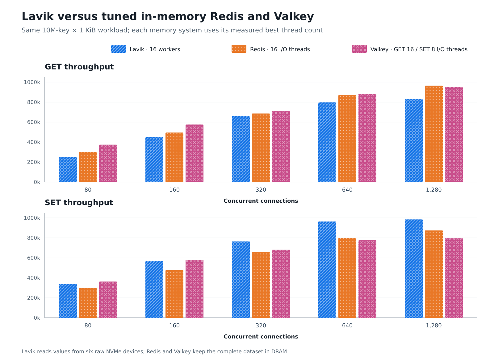
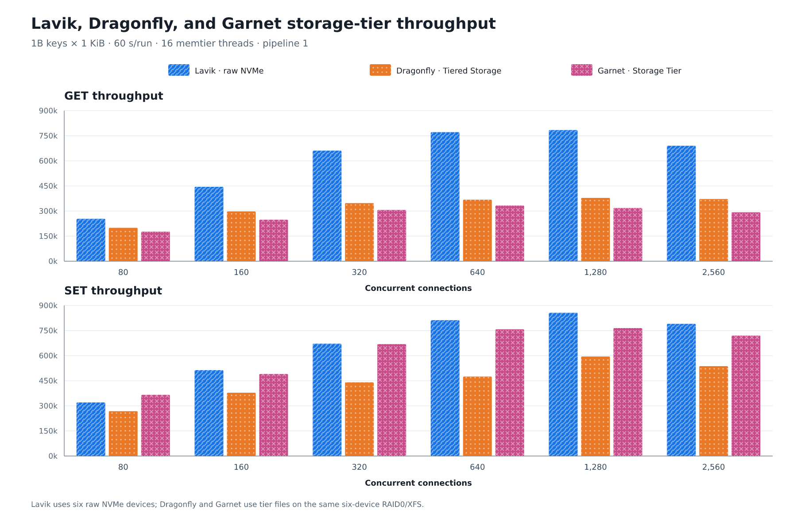
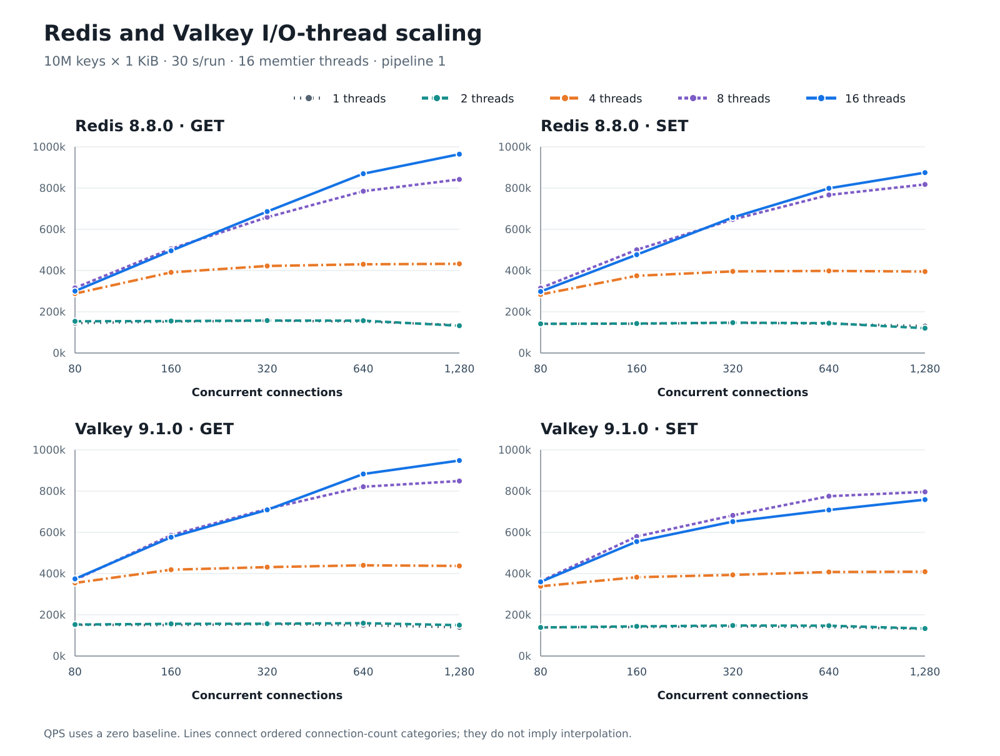

<!--
Copyright (C) 2026 EloqData Inc.

Licensed under the Apache License, Version 2.0 (the "License");
you may not use this file except in compliance with the License.
You may obtain a copy of the License at

    https://www.apache.org/licenses/LICENSE-2.0

Unless required by applicable law or agreed to in writing, software
distributed under the License is distributed on an "AS IS" BASIS,
WITHOUT WARRANTIES OR CONDITIONS OF ANY KIND, either express or implied.
See the License for the specific language governing permissions and
limitations under the License.
-->

# Lavik、Redis、Valkey、Dragonfly 与 Garnet：1 KiB 高并发性能对比

[English](README.md) | **简体中文** | [报告目录](../README.md)

> 恢复来源： [2026-09-15 历史版本](https://github.com/eloqdata/lavik/tree/eedb3080d808769519d93e971195b53b38b09c1e/perf_reports)。
> 已恢复原有图表、CSV、哈希清单和辅助脚本。脚本引用原测试主机与原始输入路径；这些原始日志不在目录中。

测试日期：2026-09-06

## 技术结论

本报告包含两个独立实验组。在 10,000,000-key × 1,024-byte（约 10 GB）
纯内存对照中，六盘 raw io_uring Lavik 的最佳 GET 为
**828,502 QPS**，比调到本轮最优的纯内存 Redis 8.8.0 低 **14.1%**，
比纯内存 Valkey 9.1.0 低 **12.6%**。Lavik 的最佳 SET 为
**984,452 QPS**，反而比 Redis 高 **12.5%**、比 Valkey 高 **23.7%**。

在另一个 1,000,000,000-key × 1,024-byte（约 1 TB）分层存储实验中，
Lavik raw io_uring 的 GET 峰值为 **784,179 QPS**，分别比 Dragonfly
v1.40.2 和 Garnet v2.1.5 高 **107.0%**、**135.7%**；SET 峰值为
**856,523 QPS**，分别高 **44.0%**、**12.0%**。三个系统在 2,560 连接
均从峰值回退，各自峰值都位于 640–1,280 连接区间。

因此，这些结果支持一个有边界的结论：在本机、1 KiB value、pipeline=1
和单客户端上，Lavik 的随机读吞吐与调优后的纯内存系统相差约
13%–14%，写吞吐没有落后；面对同量级的大容量分层存储产品时，Lavik
的读写吞吐也保持领先。10 GB 与 1 TB 两组使用不同数据集、运行时长和
存储模型，不能跨组直接排行，也不证明任意硬件或耐久性配置都有同样差距。

Redis/Valkey 必须开启足够多的 I/O threads 才能形成公平比较。1–2
threads 的峰值只有约 144k–159k QPS；Redis 在 16 threads 达到本轮最佳，
Valkey GET 在 16 threads 最佳，但 Valkey SET 在 8 threads 最佳，增加到
16 threads 后下降 4.7%。

若需要比较更多磁盘型 Redis 兼容系统及不同持久化、WAL、compaction
配置，请参阅[更完整的持久化与分层存储对比报告](../lavik-vs-dragonfly-tiering-2026-08-11/README.zh-CN.md)。

## Lavik 与调优后纯内存系统的差距

图中的纯内存配置按命令选择本轮实测最优线程数：Redis GET/SET 都是
16 I/O threads；Valkey GET 是 16、SET 是 8。Lavik 固定为 16 workers。
这样比较的是每个系统在已测配置中的最好结果，而不是用单线程
Redis/Valkey 放大 Lavik 优势。

| 负载 | 系统与配置 | 峰值 QPS | 峰值连接数 | Avg | p50 | p99 | p99.9 | p99.99 |
|---|---|---:|---:|---:|---:|---:|---:|---:|
| GET | Lavik，16 workers | 828,502 | 1,280 | 1.544 ms | 1.319 ms | 4.543 ms | 11.199 ms | 21.887 ms |
| GET | Redis，16 I/O threads | 964,267 | 1,280 | 1.327 ms | 1.111 ms | 4.671 ms | 8.191 ms | 17.407 ms |
| GET | Valkey，16 I/O threads | 948,300 | 1,280 | 1.349 ms | 1.111 ms | 4.479 ms | 8.383 ms | 17.151 ms |
| SET | Lavik，16 workers | 984,452 | 1,280 | 1.300 ms | 1.159 ms | 4.575 ms | 7.455 ms | 16.063 ms |
| SET | Redis，16 I/O threads | 874,879 | 1,280 | 1.463 ms | 1.191 ms | 4.767 ms | 7.839 ms | 17.663 ms |
| SET | Valkey，8 I/O threads | 796,145 | 1,280 | 1.607 ms | 1.447 ms | 4.319 ms | 9.471 ms | 17.919 ms |

峰值点的 p99 很接近：GET 为 4.48–4.67 ms，SET 为 4.32–4.77 ms。
Lavik GET 的 p99.99 较差，但 Lavik SET 的 p99.9/p99.99 都优于两套
纯内存对照。吞吐接近并不是以明显恶化 p99 换来的。

### 各连接数的精确 QPS

| 负载 | 连接数 | Lavik 16 workers | Redis 16 I/O threads | Valkey 最佳线程配置 |
|---|---:|---:|---:|---:|
| GET | 80 | 251,872 | 300,320 | 374,308（16） |
| GET | 160 | 447,569 | 496,011 | 576,207（16） |
| GET | 320 | 658,224 | 686,043 | 708,992（16） |
| GET | 640 | 796,395 | 869,620 | 882,881（16） |
| GET | 1,280 | 828,502 | 964,267 | 948,300（16） |
| SET | 80 | 338,732 | 298,222 | 362,610（8） |
| SET | 160 | 566,366 | 476,830 | 579,863（8） |
| SET | 320 | 764,712 | 657,652 | 682,094（8） |
| SET | 640 | 964,503 | 798,889 | 775,229（8） |
| SET | 1,280 | 984,452 | 874,879 | 796,145（8） |

## 1 TB 分层存储：Lavik 领先 Dragonfly 与 Garnet

这一组把 key 数扩大到 10 亿，逻辑 value payload 为 1.024 TB（约
953.7 GiB），因此与上面的 10 GB 纯内存实验分开分析。Lavik 直接使用
六块 raw NVMe；Dragonfly Tiered Storage 和 Garnet Storage Tier 使用
同一组六盘组成的 RAID0/XFS。三者均使用同一服务端、同一客户端、16 个
memtier threads、pipeline=1，每点运行 60 秒。

Lavik 的 GET 在 1,280 连接达到 784,179 QPS，是 Dragonfly 峰值的
2.07 倍、Garnet 峰值的 2.36 倍；SET 在 1,280 连接达到 856,523 QPS，
比 Dragonfly 高 44.0%，比 Garnet 高 12.0%。Dragonfly GET 的吞吐随着
并发上升，但峰值 p99 已达到 47.615 ms；Garnet GET 的尾延迟更稳，却在
640 连接后开始回退。Lavik 在 2,560 连接同样回退，继续增加连接只会
增加排队和尾延迟。

| 负载 | 系统与配置 | 峰值 QPS | 峰值连接数 | Avg | p50 | p99 | p99.9 |
|---|---|---:|---:|---:|---:|---:|---:|
| GET | Lavik，16 workers，raw NVMe | 784,179 | 1,280 | 1.632 ms | 1.527 ms | 4.095 ms | 8.895 ms |
| GET | Dragonfly，16 proactors，Tiered Storage | 378,851 | 1,280 | 3.378 ms | 1.439 ms | 47.615 ms | 77.823 ms |
| GET | Garnet，Storage Tier | 332,665 | 640 | 1.923 ms | 1.735 ms | 3.743 ms | 5.503 ms |
| SET | Lavik，16 workers，raw NVMe | 856,523 | 1,280 | 1.494 ms | 1.015 ms | 8.511 ms | 12.799 ms |
| SET | Dragonfly，16 proactors，Tiered Storage | 594,941 | 1,280 | 2.151 ms | 1.551 ms | 21.375 ms | 51.199 ms |
| SET | Garnet，Storage Tier | 764,917 | 1,280 | 1.673 ms | 1.399 ms | 5.183 ms | 11.263 ms |

### 各连接数的精确 QPS

| 负载 | 连接数 | Lavik raw io_uring | Dragonfly Tiered Storage | Garnet Storage Tier |
|---|---:|---:|---:|---:|
| GET | 80 | 253,251 | 199,548 | 177,016 |
| GET | 160 | 444,808 | 297,609 | 247,875 |
| GET | 320 | 661,401 | 347,584 | 306,277 |
| GET | 640 | 771,496 | 367,956 | 332,665 |
| GET | 1,280 | 784,179 | 378,851 | 318,165 |
| GET | 2,560 | 690,259 | 371,890 | 292,482 |
| SET | 80 | 320,360 | 268,251 | 365,630 |
| SET | 160 | 513,385 | 378,335 | 490,332 |
| SET | 320 | 671,865 | 440,722 | 669,057 |
| SET | 640 | 811,734 | 474,879 | 757,442 |
| SET | 1,280 | 856,523 | 594,941 | 764,917 |
| SET | 2,560 | 790,186 | 537,193 | 720,262 |

低并发下 Garnet SET 更快：80 连接时比 Lavik 高 14.1%。Lavik 从
160 连接开始反超，并在 640–1,280 连接扩大优势。因此“Lavik SET
始终最快”并不成立；更准确的结论是它在本轮高并发饱和区间具有最高峰值。

## I/O threads 决定 Redis/Valkey 能否接近 Lavik

1→2 I/O threads 对两套系统几乎没有帮助；4 threads 开始明显扩展，
8 threads 后才进入 800k QPS 区间。Redis 的 GET/SET 在已测范围内仍随
16 threads 上升。Valkey 的 GET 也继续上升，但 SET 在 8 threads 后回退，
说明“线程越多越快”不成立，生产配置需要按负载选择。

| 系统 | I/O threads | GET 峰值 QPS @ 连接数 | SET 峰值 QPS @ 连接数 |
|---|---:|---:|---:|
| Redis 8.8.0 | 1 | 156,477 @ 320 | 146,263 @ 320 |
| Redis 8.8.0 | 2 | 157,452 @ 320 | 147,218 @ 320 |
| Redis 8.8.0 | 4 | 432,526 @ 1,280 | 398,222 @ 640 |
| Redis 8.8.0 | 8 | 841,942 @ 1,280 | 817,501 @ 1,280 |
| Redis 8.8.0 | 16 | 964,267 @ 1,280 | 874,879 @ 1,280 |
| Valkey 9.1.0 | 1 | 154,406 @ 320 | 143,854 @ 320 |
| Valkey 9.1.0 | 2 | 159,368 @ 640 | 148,006 @ 320 |
| Valkey 9.1.0 | 4 | 440,085 @ 640 | 409,011 @ 1,280 |
| Valkey 9.1.0 | 8 | 848,840 @ 1,280 | 796,145 @ 1,280 |
| Valkey 9.1.0 | 16 | 948,300 @ 1,280 | 758,618 @ 1,280 |

## 测试口径与指标定义

- 服务端：`172.16.0.4`，AMD EPYC 9V74，8 cores / 16 threads，125 GiB
  RAM；所有服务端线程限制在 CPU 0–15。
- 客户端：`172.16.0.5`，16 cores，31 GiB RAM；memtier 2.5.1 固定
  16 threads 并限制在 CPU 0–15。`.6` 在本轮不可达，因此只使用一个客户端。
- 数据集：纯内存组使用 10,000,000 个十进制数字 key，逻辑 value
  payload 为 10.24 GB（9.54 GiB）；分层存储组使用 1,000,000,000 个 key，
  逻辑 value payload 为 1.024 TB（953.7 GiB）。每个 value 都固定为
  1,024 bytes。Redis 灌数后 `used_memory=12.46G`，Valkey 为 `12.36G`。
- 负载：GET 为全 key 范围均匀随机且 100% 命中；SET 为均匀随机覆盖
  已有 key，不新增 key。
- 并发：纯内存组为 80、160、320、640、1,280 个连接，每点 30 秒；
  分层存储组额外包含 2,560 连接，每点 60 秒。两组均为 pipeline=1。
  QPS 是正式窗口内完成请求数除以窗口墙钟。
- 延迟：均为 memtier 客户端端到端观测值；表中单位为毫秒。

## 实施方法

- Lavik 使用代码提交
  [`29dc8e6`](https://github.com/thweetkomputer/lavik/commit/29dc8e6b87c40196dc397759690252944f1196f0)，
  Clang 18 Release、`-march=native`、16 workers、六块独立 raw NVMe 的
  io_uring 后端、暂停 defrag。二进制 SHA-256 为
  `ef8cc3f1b815fe123f408626f8d4dadfc3a509ed7f63ab5de17e3e237b2d82fd`。
- Redis 使用官方 [8.8.0 release](https://github.com/redis/redis/releases/tag/8.8.0)，
  Valkey 使用官方 [9.1.0 release](https://github.com/valkey-io/valkey/releases/tag/9.1.0)；
  两者均按源码默认 jemalloc、`-O3` 构建，不加载额外模块。
- Redis/Valkey 关闭 AOF 和自动 RDB 保存。首次精确灌入 10M key 并验证
  `DBSIZE` 后保存一个基线 RDB；每个 I/O-thread 档都从这个未被正式 SET
  改写的 RDB 重启，验证 key 数和 `CONFIG GET io-threads`，预热 GET 10 秒，
  再按连接数由低到高跑 GET 和 SET。
- Lavik 六盘从 RAID0 解组后逐盘 `blkdiscard`，只灌入一次 10M key，
  验证 `DBSIZE`，预热 GET 10 秒，再按相同顺序测试。
- 1 TB 组使用同一份 10 亿 key × 1 KiB 测试口径。Lavik raw io_uring
  直接打开六块 NVMe；[Dragonfly v1.40.2](https://github.com/dragonflydb/dragonfly/releases/tag/v1.40.2)
  使用 16 proactors、96 GiB `maxmemory` 和 RAID0/XFS 上的 Tiered
  Storage；[Garnet v2.1.5](https://github.com/microsoft/garnet/releases/tag/v2.1.5)
  使用 64 GiB hybrid-log memory、32 GiB read cache、16 GiB index 和
  同一 RAID0/XFS 上的 Storage Tier。Dragonfly 在正式 GET 前额外运行
  180 秒随机读预热。
- 复现入口为 [`run_memory_sweep.sh`](run_memory_sweep.sh) 和
  [`run_lavik_sweep.sh`](run_lavik_sweep.sh)；规范化与图表生成入口为
  [`build_assets.py`](build_assets.py)。纯内存组 110 个正式点见
  [`results.csv`](results.csv)，分层存储组 36 个正式点见
  [`storage-results.csv`](storage-results.csv)；对应的原始输入哈希分别见
  [`raw-SHA256SUMS`](raw-SHA256SUMS) 和
  [`storage-raw-SHA256SUMS`](storage-raw-SHA256SUMS)。

报告、脚本、CSV 和校验清单中的产品名称及路径均已统一为 Lavik。
外部原始输入未随仓库提供，其已记录的哈希保持不变；复现时需将这些输入
放到 `build_assets.py` 使用的规范化路径下。

## 限制、异常与稳健性

- 每个点目前只有一轮：纯内存组 30 秒、分层存储组 60 秒。适合判断
  十几个百分点和倍数级差异，不能把 1%–3% 当成稳定优势。应在关键的
  640/1,280 连接点交错重复三次。
- 单客户端仍可能限制最高值。峰值点客户端平均使用的核心数为：Lavik
  GET 11.38、SET 14.27；Redis GET 13.29、SET 12.41；Valkey GET 12.85、
  SET 11.16。Lavik SET 尤其接近客户端 CPU 上限，因此 984k 是当前
  单客户端口径下的观测值，不一定是服务端上限。
- Redis/Valkey 的正式窗口完全关闭持久化；Lavik 把 value 写到 raw
  NVMe，但本报告不声称三者具备等价的崩溃耐久语义。这里回答的是请求
  路径性能差距，不是同耐久级别成本。
- 两个实验组不可互换：Redis/Valkey 数字来自可完全装入 DRAM 的 10 GB
  工作集；Dragonfly/Garnet 数字来自 1 TB 分层存储工作集。分层存储组内
  也不是单变量后端实验：Lavik 看见六个独立 raw 设备，Dragonfly 和
  Garnet 看见 RAID0/XFS 文件，并采用不同内存预算、缓存和后台维护策略。
- 一个不计入正式结果的 Lavik 准备运行，在“恢复已有 10M key、再次
  覆盖灌数、请求 metrics”这一时刻发生 general-protection fault。因果
  尚未定位。重新清盘、取消主动 metrics 抓取后的 10 个正式点全部完成且
  无断连；异常日志保留在原始结果目录，不能据此认定 metrics 是根因。
- 全部正式 GET 均为零 miss；146 个结果文件都有且只有一个完整 `Totals`
  行；Redis/Valkey 五档线程数均通过服务端配置回读；六个结果目录的
  SHA-256 校验全部通过。

## 建议的下一步

1. 在 640 和 1,280 连接对纯内存组三套最优配置交错跑三次，报告均值、
   标准差和最差 p99.99；分层存储组三套配置也在相同点重复。
2. 恢复第二台客户端或增加客户端 CPU，验证 Lavik SET 和 Redis/Valkey
   GET 是否被当前单客户端封顶。
3. 单独复现并定位 Lavik 准备阶段 general-protection fault，分别隔离
   恢复后覆盖写、后台 flush 和 metrics scrape。
4. 若要比较生产代价，再增加 Redis/Valkey AOF `everysec` 和明确 fsync
   策略的耐久性对等测试，不要把本轮无持久化纯内存数据直接当生产结论。
5. 对 1 TB 组统一 raw-device 或统一 RAID0/XFS 后端，并统一内存预算，
   区分产品请求路径优势与存储拓扑、缓存策略带来的差异。

## 仍待回答的问题

- Redis/Valkey 的 12 I/O threads 是否比 8/16 更适合这台 8C/16T 主机？
- value 变为 64 B、4 KiB 或出现热点分布后，Lavik 的相对差距如何变化？
- 双客户端下超过 1M QPS 后，限制首先来自服务器、客户端还是网络？
- Dragonfly/Garnet 改为与 Lavik 相同的 raw-device 拓扑（若产品支持）
  或 Lavik 改为相同的 RAID0/XFS 文件后，1 TB 组差距还剩多少？
