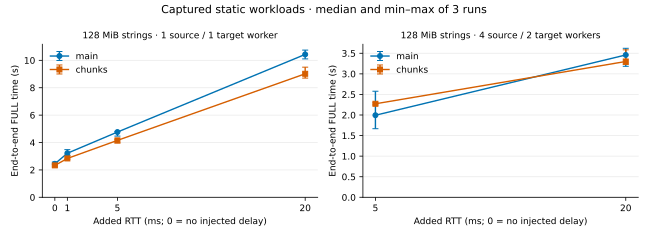

# Native FULL 大对象记录窗口性能报告

2026-10-04 · [English](README.md) · [方法与边界](METHODS.md) · [复现](REPRODUCE.md)

大对象记录窗口在本次单 source flow 场景降低了端到端 FULL 耗时：128 MiB 字符串在附加 RTT 5/20 ms 下，中位数分别下降 **12.76% / 13.57%**；大 Hash 下降 **13.69% / 18.54%**。收益有明确边界：**4 source flows、5 ms、抓包场景回退 13.95%**，随后同参数无抓包组却改善 21.30%；零附加延迟的无抓包组回退 1.23%。因此不能宣称普遍加速，也不能用后测组精确扣除抓包开销。

## 比较对象与实验条件

优化前为 main `25e159418603a95c1b2cca68173b329067e3ef48`，优化后为 chunks `51d03f97fede341fb42c14bd46a9f1aaf416eeb1`。实现允许每个 source flow 同时保留最多 8 个、合计 16 MiB 的大对象记录帧，在释放对象生命周期保护前等待其 receipts。功能测试分别覆盖 baseline、replacement、publish FIFO 来源；这里的 live 性能负载混合这些路径，不能分别测出各来源的加速比例。[功能验收证据](validation/VALIDATION.md)。

后续发布 HEAD 可以包含文档或等价测试 fixture 更新，二进制来源仍固定为上述实际测量 core revisions。双方使用相同 GCC 13.3 Release native O3/LTO、Bycorf revision 和服务器配置。[来源与二进制哈希](evidence/cohort.json)、[构建证据](evidence/build/)保留完整信息。主机为 8 CPU、NVMe，数据刚完成确定性 seed；没有冷缓存准备，也不是超内存数据测试。1 source flow 配 1 target worker；4 source flows 配 2 target workers，source/target/client CPU 集合互不重叠。RTT 通过任务专属 veth 两端 netem 注入；0 表示不增加延迟，并非真实 RTT 为零。[每轮实测 idle PING](evidence/conditions.md)。

Backlog 为**每进程全局 64 MiB**，在 data-worker flows 间均分；publisher queue 为**每 worker 16 MiB**，独立的 `queue32` live 组为**每 worker 32 MiB**。这些配置不等于 sender window 的 credit 上限。正式性能数据全部位于 DB 0；完整 corpus、CPU、存储、抓包、计时定义见[方法](METHODS.md)。

本报告包含 **14 个完整比较、84 次 accepted runs**，每组 A/B、B/A、A/B 三次配对。两个报告合计 162 次可比较 accepted runs，另保留 2 次原组 partial accepted 和 2 次 rejected，共 166 次尝试。每次 accepted 均满足单次 FULL、全部预期 flows、逐 flow 的同步后 fence 可见和完整内容 digest 相等；抓包组还要求 native stream 完整、内核抓包丢包为零。未删除任何慢但有效的样本。

## 抓包组端到端 FULL

计时从发出 `LAVIK.REPLICAOF` 前到 target 被观察为 ONLINE，包含 reset、传输、handoff、final cut 和轮询；不含启动、seed、之后的 digest 验证。耗时下降为正表示变快，负值表示变慢。表中保留 r1/r2/r3 顺序。

| 场景 | 优化前 r1 / r2 / r3（秒） | 前中位数 | 优化后 r1 / r2 / r3（秒） | 后中位数 | 耗时下降 | 加速比 |
| --- | --- | --- | --- | --- | --- | --- |
| large-hash-128m-f1-rtt20 | 20.7283, 20.5630, 20.1671 | 20.5630 | 16.7511, 16.6005, 17.1841 | 16.7511 | 18.54% | 1.228× |
| large-hash-128m-f1-rtt5 | 15.1408, 14.2867, 13.7164 | 14.2867 | 12.3303, 13.2779, 12.2749 | 12.3303 | 13.69% | 1.159× |
| large-live-128m-f1-rtt20-queue32 | 13.7024, 13.8993, 13.4126 | 13.7024 | 10.5407, 10.3854, 10.5759 | 10.5407 | 23.07% | 1.300× |
| large-live-128m-f1-rtt5 | 5.3479, 5.3089, 5.2680 | 5.3089 | 4.7452, 5.2757, 4.7880 | 4.7880 | 9.81% | 1.109× |
| large-live-128m-f1-rtt5-queue32 | 4.8219, 5.6541, 5.7339 | 5.6541 | 4.8444, 4.8904, 5.4021 | 4.8904 | 13.51% | 1.156× |
| large-string-128m-f1-rtt0 | 2.5744, 2.4457, 2.4231 | 2.4457 | 2.3300, 2.3504, 2.2237 | 2.3300 | 4.73% | 1.050× |
| large-string-128m-f1-rtt1 | 3.4783, 3.0659, 3.2179 | 3.2179 | 2.8366, 3.0259, 2.7850 | 2.8366 | 11.85% | 1.134× |
| large-string-128m-f1-rtt20 | 10.7465, 10.1033, 10.4320 | 10.4320 | 9.5011, 8.7026, 9.0166 | 9.0166 | 13.57% | 1.157× |
| large-string-128m-f1-rtt5 | 4.4691, 4.7640, 4.8089 | 4.7640 | 4.1560, 4.2270, 3.9605 | 4.1560 | 12.76% | 1.146× |
| large-string-128m-f4-rtt20 | 3.4593, 3.6217, 3.1836 | 3.4593 | 3.3008, 3.2289, 3.5839 | 3.3008 | 4.58% | 1.048× |
| large-string-128m-f4-rtt5 | 2.5770, 1.6670, 1.9945 | 1.9945 | 2.2727, 2.2953, 2.2451 | 2.2727 | -13.95% | 0.878× |

4-flow 5 ms 的负结果必须保留：优化前 1.6670–2.5770 秒，优化后 2.2451–2.2953 秒。4-flow 20 ms 的中位数仅改善 4.58%，且第三对变慢。三次重复和最小—最大值仅描述本次观察，不是统计置信区间。

## 同参数无抓包控制

控制组在稍后时间运行，双方均关闭抓包，保持 workload、workers、CPU 和服务器配置相同。4-flow 控制是在发现原回退后、任何控制组运行前声明的补充；它不会替代原抓包结果。后测 cohort 无法单独分离抓包与时间漂移的影响。

| 场景 | 优化前 r1 / r2 / r3（秒） | 前中位数 | 优化后 r1 / r2 / r3（秒） | 后中位数 | 耗时下降 | 加速比 |
| --- | --- | --- | --- | --- | --- | --- |
| large-string-128m-f1-rtt0-nocap | 2.5841, 2.3736, 2.2787 | 2.3736 | 2.3973, 2.4028, 2.7017 | 2.4028 | -1.23% | 0.988× |
| large-string-128m-f1-rtt20-nocap | 9.7902, 9.9831, 9.9386 | 9.9386 | 9.1836, 8.5406, 9.0324 | 9.0324 | 9.12% | 1.100× |
| large-string-128m-f4-rtt5-nocap | 2.0179, 1.8232, 2.0684 | 2.0179 | 1.5881, 1.5629, 1.6420 | 1.5881 | 21.30% | 1.271× |

单 flow 20 ms 无抓包仍改善 9.12%；4-flow 5 ms 方向反转，零延迟收益消失。结论是结果对负载和观测条件敏感，不能选择性只保留有利的一组。

## 大对象 live 写入及原 baseline 停滞

writer 在 warmup 5 秒后，以每秒 1 次同步事务轮换更新已有 16 MiB 字符串。原 16 MiB publisher queue、20 ms 的 **main** 首轮长期没有 native 进度，超过 5 分钟后显式中断；writer 自身在 30.052 秒 socket timeout。它不是 900 秒 FULL timeout 的性能样本，没有最终 digest；原配置下候选及剩余重复未运行。[故障调查与原始证据](BASELINE-STALL.md)显示现场与源码中的 gate/admission/fence 循环等待一致，但没有 coroutine 栈证明。此 PR 不声称修复该问题。

随后新建双方均使用每 worker 32 MiB publisher queue 的配对组，保持负载、频率、backlog 不变。5/20 ms 共 12 次全部验收，中位数改善 13.51% / 23.07%；与原 queue16、5 ms 的 9.81% 分开报告，不混平均。queue32、20 ms 的 main 在 FULL 内完成 13/14/13 次写入，候选为 10/10/10；观察到的 native 帧字节约为 242.58/258.58/242.58 MiB 对 210.58 MiB（三次相同）。这是总工作量随完成时长变化的 live 结果，不是固定字节数吞吐测试。

queue32、20 ms 每轮有 5 个候选 key、6 个 baseline key 出现重复 large-value begin，表明确有大对象重复传输。wire 没有 baseline/replacement/FIFO 来源标签，不能据此分别宣称各来源的性能收益；独立功能测试覆盖其正确性。

每轮在 FULL 内开始的写入只有 4–14 次，不能据此作可靠 p99/p99.9 结论。queue32、5 ms 候选观察到的最大延迟为 **695.54 ms**，baseline 最大为 **156.90 ms**；20 ms 为 **515.40 / 208.69 ms**。两次候选 5 ms 操作越过 ONLINE 才结束，仍计入延迟样本。FULL 更快并不证明前台延迟不变。[逐轮计数、QPS、延迟](evidence/live.md)完整保留。

## 资源与帧证据

单 flow 字符串、5 ms 的“三次各自 FULL 内 sampled peak RSS 的中位数”：source 249.5→249.3 MiB，target 233.3→235.0 MiB。有效采样区间平均 busy cores 的中位数为 source 0.249→0.277、target 0.097→0.116，区间仅覆盖 FULL 约 78–87%。[资源表](evidence/resources.md)及[逐轮 JSON](evidence/per-run.json)保留逐轮 sampled peaks、CPU 汇总和有效区间；完整 raw samples 留在 NVMe。它们不是精确 allocation/sender-credit 高水位，也不能外推完整 FULL CPU 成本。

静态单 flow 字符串有 8 个 partition+DB groups，各 10 帧、合计 80 record frames；Hash 有 4 组各 19 帧、合计 76 帧。字符串 5 ms 的 source record-byte 观察跨度中位数为 3.9357→3.5135 秒，跨度包含中间等待和其他工作，不能作为独占阶段或从 FULL 相减求 reset/handoff 时间。[跨度](evidence/spans.md)、[帧分布](evidence/frame-distribution.csv)、[完整分区/DB 映射](evidence/raw-results.jsonl)可核验。

两个报告共 134 个 accepted captures 的可选跨度分析全部成功，其中 16 个出现 source TCP payload 的重复观察。这与重传一致，但不是 qdisc 丢包计数。4-flow 字符串 5 ms 的重复字节分别为 main 170/0/65,160，chunks 1,205/4,492/3,267；不足以归因回退。[逐轮 TCP overlap](evidence/tcp-overlap.jsonl)。tcpdump 零丢包不等于网络零丢包。

## 可审核和复现材料

- [逐轮 CSV](evidence/per-run.csv)、[详细 JSON](evidence/per-run.json)、[比较与配对比例](evidence/comparisons.json)、[原始结果/acceptance/driver outcome](evidence/raw-results.jsonl)。
- [原始文件路径与哈希](evidence/retained-artifacts.json)：完整 pcap/raw samples 留在原 NVMe 目录；[最终清理读回](evidence/final-cleanup.json)无任务进程和 netns，成功 data 已移除、失败 data 保留。
- [复现说明](REPRODUCE.md)、[可移植工具](tools/)、[历史精确工具/recipes](evidence/historical-tools/)、[baseline 故障证据](evidence/diagnostic-failure/)。

普通 baseline records 报告有独立的 parent→candidate 测量；两份报告的比例不能相乘为 main→完整 stack 加速结论。
