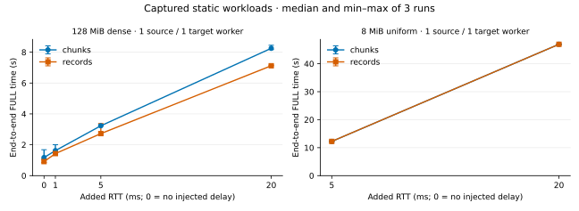

# Native FULL ordinary baseline-record window: measured results

2026-10-04 · [中文](README.zh-CN.md) · [Shared methods](../native-full-large-record-window-2026-10-04/METHODS.md) · [Reproduce](../native-full-large-record-window-2026-10-04/REPRODUCE.md)

Pipelining ordinary baseline record frames reduced FULL time for the measured dense, single-source-flow corpus: **15.69% at 5 ms added RTT** and **13.69% at 20 ms**. Sparse/uniform groups with one record frame each show essentially no benefit. Sustained 500 ops/s foreground writes leave FULL near ten minutes, with only **2.88%** median improvement. Four-source-flow results are variable, including a **4.36% regression at 20 ms** in the complete replacement cohort. The data supports a dense-record optimization, not a general native FULL speedup.

## Comparison and conditions

This is an independently measured marginal comparison from chunks `51d03f97fede341fb42c14bd46a9f1aaf416eeb1` to records `9da9c797eefaea45dfde3ccc521baa440de559a8`. The candidate stacks on the large-value window and pipelines ordinary baseline frames within a partition/DB. It preserves drains at DB boundaries, before nonempty live publish FIFO service, and before dependent lifecycle barriers. Ordinary replacement/publish-record traffic and command scheduling are not redesigned. **Main→records was not measured for these ordinary corpora**, and this report makes no combined main-to-stack claim.

Exact revisions, binary hashes and build settings are in [cohort provenance](evidence/cohort.json) and [build evidence](evidence/build/). Both variants use GCC 13.3 Release native O3/LTO and the same Bycorf revision. On the eight-CPU NVMe host, one source flow uses one target worker; four source flows use two target workers with disjoint CPU sets. The backlog is 64 MiB globally per process; publisher queues here are 16 MiB per worker. The injected RTT comes from task-owned veth/netem links, and [conditions](evidence/conditions.md) retain measured idle PING values. Fresh seeds are not cold-cache or larger-than-memory evidence. See [shared methods](../native-full-large-record-window-2026-10-04/METHODS.md) and [functional validation](../native-full-large-record-window-2026-10-04/validation/VALIDATION.md).

The dense seed has 32,768 ordinary 4 KiB values (128 MiB), concentrated in one partition per source flow. The sparse/uniform seed has 2,048 4 KiB values (8 MiB) spread across partitions; its smaller size bounds the stop/wait runtime. Compare variants within a case, not absolute throughput across these differently sized corpora. All formal performance data uses DB 0.

There are **13 complete comparisons / 78 comparable accepted runs**, plus **two retained accepted partial observations** from the original four-flow 20 ms cohort. Three paired repetitions use A/B, B/A, A/B order. Every accepted run passes single-FULL/all-flow guards, post-FULL per-flow fence writes and equal complete source/target digests. Captured runs also require zero kernel capture drops and complete native streams. All valid repetitions are retained.

## Captured end-to-end FULL results

Times run from immediately before `LAVIK.REPLICAOF` to observed target ONLINE, including reset, transfer, handoffs, final cut and polling. Startup, seed and later digest checking are outside the timer. Positive time reduction means faster. Each row retains r1/r2/r3 in repetition order.

| Case | Before r1 / r2 / r3 (s) | Before median | After r1 / r2 / r3 (s) | After median | Time reduction | Speedup |
| --- | --- | --- | --- | --- | --- | --- |
| dense-live-128m-f1-rtt5 | 639.1325, 637.6717, 644.1651 | 639.1325 | 631.9098, 620.6961, 613.0959 | 620.6961 | 2.88% | 1.030× |
| dense-records-128m-f1-rtt0 | 1.0946, 1.1753, 1.6806 | 1.1753 | 1.0562, 0.9117, 0.8530 | 0.9117 | 22.43% | 1.289× |
| dense-records-128m-f1-rtt1 | 1.6223, 2.0047, 1.6020 | 1.6223 | 1.5166, 1.3880, 1.4304 | 1.4304 | 11.83% | 1.134× |
| dense-records-128m-f1-rtt20 | 8.4498, 8.1705, 8.2523 | 8.2523 | 7.1217, 7.1223, 7.1636 | 7.1223 | 13.69% | 1.159× |
| dense-records-128m-f1-rtt5 | 3.2288, 3.3125, 3.2324 | 3.2324 | 2.7250, 3.3794, 2.6487 | 2.7250 | 15.69% | 1.186× |
| dense-records-128m-f4-rtt20-capture-repeat | 2.6161, 2.8188, 2.7373 | 2.7373 | 2.4943, 2.8566, 3.1522 | 2.8566 | -4.36% | 0.958× |
| dense-records-128m-f4-rtt5 | 1.1112, 1.1117, 2.3956 | 1.1117 | 1.3131, 1.0857, 0.9842 | 1.0857 | 2.35% | 1.024× |
| uniform-records-8m-f1-rtt20 | 46.9394, 46.9540, 46.9488 | 46.9488 | 46.9173, 46.9522, 46.9491 | 46.9491 | -0.00% | 1.000× |
| uniform-records-8m-f1-rtt5 | 12.4175, 12.1926, 12.2356 | 12.2356 | 12.4384, 12.2483, 12.1805 | 12.2483 | -0.10% | 0.999× |
| uniform-records-8m-f4-rtt20 | 12.3455, 12.3812, 12.3048 | 12.3455 | 12.3058, 12.3818, 12.3405 | 12.3405 | 0.04% | 1.000× |
| uniform-records-8m-f4-rtt5 | 3.6508, 3.1978, 3.2735 | 3.2735 | 3.1982, 3.7023, 3.1978 | 3.1982 | 2.30% | 1.024× |

The dense 5 ms median does not mean every pair improved: r2 is 3.3125→3.3794 s, a regression. Four-flow 5 ms has large variation in the before values; four-flow 20 ms regresses in the full replacement cohort. Uniform 1flow 20 ms is 46.9488→46.9491 s, effectively unchanged; uniform 4flow 20 ms differs by only 0.04%. Three repetitions and min–max bars do not provide statistical confidence intervals.

## Matched no-capture controls

These later cohorts preserve all workload/server/worker/CPU conditions and disable capture for both variants. They describe observation sensitivity rather than a precise capture-overhead subtraction.

| Case | Before r1 / r2 / r3 (s) | Before median | After r1 / r2 / r3 (s) | After median | Time reduction | Speedup |
| --- | --- | --- | --- | --- | --- | --- |
| dense-records-128m-f1-rtt0-nocap | 0.8314, 0.8737, 0.8717 | 0.8717 | 0.7937, 0.7324, 0.7724 | 0.7724 | 11.40% | 1.129× |
| dense-records-128m-f1-rtt20-nocap | 8.0589, 8.2542, 8.1729 | 8.1729 | 7.5670, 7.0938, 7.1327 | 7.1327 | 12.73% | 1.146× |

Dense single-flow gains remain positive at both endpoints: 11.40% with no added delay and 12.73% at 20 ms. The captured zero-delay estimate is larger (22.43%) and more variable. This does not justify extrapolating the dense result to sparse data or four-source-flow layouts.

## Why distribution matters

The captured static single-flow dense seed emits **66 record frames in one partition+DB group**. The uniform seed emits **2,048 groups with exactly one record frame each**. The candidate can overlap multiple frames within the dense group; a conservative DB/partition boundary drains the window before the next sparse group. Four-source-flow dense cases have four dense groups. [Frame distribution](evidence/frame-distribution.csv) and full partition+DB maps in [raw results](evidence/raw-results.jsonl) show the actual traffic, rather than inferring it only from corpus names.

For dense 1flow 5 ms, the source record-byte observation span median is 1.4500→0.9456 s. Those spans include scanning, waiting, interleaved work and scheduling; they are not exclusive snapshot or apply times. [All spans](evidence/spans.md) remain separate from end-to-end timing. No phase subtraction or reset/handoff attribution is made.

## Sustained live writes

With 500 ordinary 128-byte SETs/s over 1,024 separate keys and five seconds of warmup, all six runs completed without retry. Before times are 639.1325/637.6717/644.1651 s; after times 631.9098/620.6961/613.0959 s. Median improvement is 2.88%, while actual completed foreground throughput remains 499.959–499.979 ops/s. There are 306,529–322,069 successful latency samples begun during FULL per run; p99 is 0.0709–0.0744 ms and observed maxima are 18.55–25.93 ms. These describe this controlled synchronous arrival rate, not saturated service capacity. [Per-run foreground statistics](evidence/live.md) retain counts and all latency summaries.

The first pair emitted 1,090 record frames on each side, versus 274,368→271,138 FULL command frames. Record payload bytes are still larger, so this is a frame-count observation, not a bandwidth-share claim. FULL-only sampled source FIFO peaks across the six runs range 4,437–28,079 bytes, with no sampled-interval publisher backpressure-counter increase. A low sampled queue does not prove cheap command service. Source-supported mechanisms include small current-prefix command batches with ACK barriers, per-partition interleaving, and the new baseline-receipt drain before a nonempty FIFO. They can restrict window occupancy, but their exclusive time contribution was not instrumented. [The detailed mechanism note](LIVE-COMMAND-MECHANISM.md) explicitly preserves the first-pair illustration alongside this final three-pair result. It does not attribute the long run to ordinary replacement records.

## Resources and invalid original capture

At dense 1flow 5 ms, the median of per-run sampled source RSS peaks is 198.1→198.2 MiB and target 169.3→169.2 MiB. Mean source busy cores over the valid sampled interval are 0.198→0.252, target 0.089→0.121; those intervals cover about 76–80% of FULL. Busy-core increases do not by themselves mean higher total FULL CPU. [Resource tables](evidence/resources.md) and [per-run JSON](evidence/per-run.json) retain RSS, retained memory, queue gauges and valid CPU intervals; none is an exact sender-credit peak or an extrapolated full-duration CPU total.

The original `dense-records-128m-f4-rtt20/r2-records` reached ONLINE 4/4 in one FULL, but tcpdump reported **one kernel capture drop**. The runner rejected capture completeness **before running the digest**, so this run has no verified digest. It is an instrumentation-invalid attempt, not evidence of a replication data error. The original r1 pair remains partial evidence in JSON/CSV and resource tables and is not pooled into the comparison. A newly declared six-run cohort with identical settings and the same 16 MiB capture buffer passed all checks; it is the `capture-repeat` row above, including its 4.36% regression. [Original failure evidence](evidence/capture-failure/) preserves the outcome and logs.

All accepted captured runs passed the normal stream and kernel-drop guards; the optional timestamp analysis also succeeded. Source TCP overlap is reported separately in [per-run analysis](evidence/tcp-overlap.jsonl). Repeated bytes are consistent with retransmission, not a measured network/qdisc loss rate. No extra diagnostic workload was added after the frozen matrix.

## Review and reproduction artifacts

- [Per-run CSV](evidence/per-run.csv), [sampled summaries and conditions](evidence/per-run.json), [comparisons and paired ratios](evidence/comparisons.json), [compact original results/acceptance/outcomes](evidence/raw-results.jsonl).
- [Raw-artifact manifest](evidence/retained-artifacts.json), [frame distribution](evidence/frame-distribution.csv), [resources](evidence/resources.md), [foreground statistics](evidence/live.md), [observed RTT conditions](evidence/conditions.md).
- [Shared reproduction guide](../native-full-large-record-window-2026-10-04/REPRODUCE.md), [portable tools](../native-full-large-record-window-2026-10-04/tools/), [historical recipes/tools](../native-full-large-record-window-2026-10-04/evidence/historical-tools/), and [shared validation](../native-full-large-record-window-2026-10-04/validation/VALIDATION.md).

Complete pcap/raw samples remain on NVMe. Final process/namespace cleanup found no owned processes or namespaces; successful data files were removed while invalid-run data remains. Source and binary provenance refers to the measured core commits, before later documentation or equivalent test-fixture publication changes.
